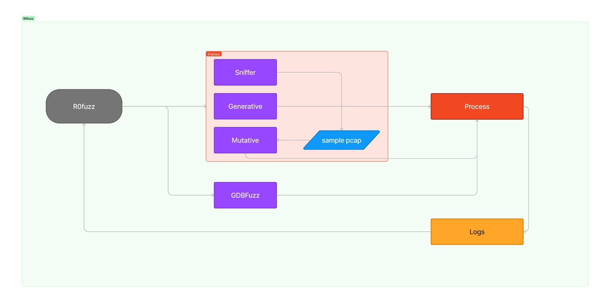

# r0fuzz

<p align="center">

</p>

## Overview <!-- omit in toc -->

Finding security flaws effectively and efficiently in Industrial Control Systems is of great importance as such systems are used in various important industries like nuclear power plants. *r0fuzz* aims to find security flaws in the hardware network protocols like MODBUS, DNP3 etc.

## Table of Contents <!-- omit in toc -->

- [1. Architecture](#1-architecture)
- [2. Installation](#2-installation)
- [3. Usage](#3-usage)
- [4. Demos](#4-demos)
- [5. Features](#5-features)
- [6. References](#6-references)

## 1. Architecture
<p align="center">

</p>

## 2. Installation

- Python virtual environment

```shell
git clone https://github.com/traboda/r0fuzz.git
cd r0fuzz


pip install virtualenv 
virtualenv fuzz_env
source fuzz_env/bin/activate
pip install -r requirements.txt
```

## 3. Usage

```shell
usage: r0fuzz.py [-h] -t TARGET [-v] [-i IP] [-p PORT] {dumb,mutate,generate} ...

A grammar based fuzzer for SCADA protocols

positional arguments:
  {dumb,mutate,generate}
    dumb                Apply dumb fuzzing technique
    mutate              Apply mutation based fuzzing technique
    generate            Apply generation based fuzzing technique

options:
  -h, --help            show this help message and exit
  -t TARGET, --target TARGET
                        target protocol
  -v, --verbosity       Log level
  -i IP, --ip IP        Target IP Address
  -p PORT, --port PORT  Target Port

```
## 4. Demos

You can find the demos [here](/demos).

## 5. Features:

- Mutation based fuzzing
- Generation based fuzzing 
- Driver module for collaboration mutation and generation based fuzzing. (Work in Progress)
- Incorporate other protocols (Work in Progress)
- Fuzzing Using Hardware breakpoints (Work in progress)

## 6. References
- [This project is an extension of our old project](https://github.com/AshwAthi8/R0fuzz/tree/master)
- [boofuzz](https://pypi.org/project/boofuzz/)
- [radasma](https://pypi.org/project/pyradamsa/)
