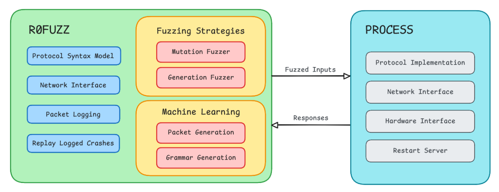

<p align="center">

</p>

## r0fuzz: A Collaborative Fuzzer <!-- omit in toc -->

Finding security flaws effectively and efficiently in Industrial Control Systems is of great importance as such systems are used in various important industries like nuclear power plants. *r0fuzz* aims to find security flaws in the hardware network protocols like MODBUS, OPC UA, DNP3 etc.

## Table of Contents <!-- omit in toc -->
- [Architecture](#1-architecture)
- [Installation](#2-installation)
- [Usage](#3-usage)
- [Features](#4-features)
- [References](#5-references)

## 1. Architecture
<p align="center">

</p>

## 2. Installation
- Python virtual environment (Tested on Python 3.10)

```shell
git clone https://github.com/br34dcrumb/r0fuzz.git
cd r0fuzz

python3 -m venv .venv
. .venv/bin/activate
pip install -r requirements.txt
```

## 3. Usage
```
usage: r0fuzz.py [-h] -t TARGET [-v] [-i IP] [-p PORT] {dumb,mutate,generate,replay} ...

A fuzzer for OT-network protocols

positional arguments:
  {dumb,mutate,generate,replay}
    dumb                Dumb fuzzing
    mutate              Mutation-based fuzzing
    generate            Generation-based fuzzing
    replay              Replay the packets

options:
  -h, --help            show this help message and exit
  -t TARGET, --target TARGET
                        Target Protocol [modbus/opcua]
  -v, --verbosity       Log level
  -i IP, --ip IP        Target IP Address [= 127.0.0.1]
  -p PORT, --port PORT  Target Port [= 1234]
```

You can find the demos [here](/demos).

## 4. Features:
- **Mutation based fuzzing**: Randomly mutates existing inputs to discover unexpected behavior based on Radamsa.
- **Generation-based fuzzing**: Crafts inputs from protocol specifications to explore deeper states using boofuzz.
- **Multi-protocol ICS support**: Currently supports Modbus. OPC UA support is in progress.
- **Hybrid fuzzing driver**: Coordinates mutation and generation strategies for improved coverage.
- Fuzzing Using Hardware breakpoints. (WIP)

## 5. References
- [boofuzz](https://github.com/jtpereyda/boofuzz)
- [radamsa](https://gitlab.com/akihe/radamsa)
